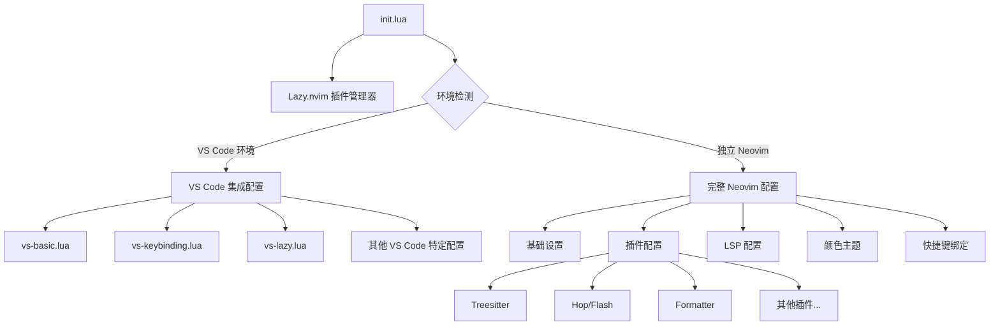
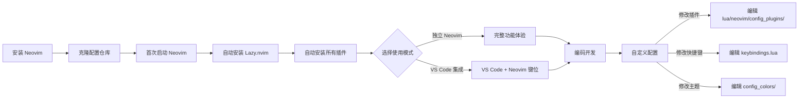

# Neovim 配置

> 这是一个功能丰富的 Neovim 配置，同时支持独立的 Neovim 环境和 VS Code 集成模式，提供了现代化的编辑体验和强大的开发工具支持。

## 概述

这个配置基于 [lazy.nvim](https://github.com/folke/lazy.nvim) 插件管理器，采用模块化设计，将不同功能的配置分离到独立的文件中，便于维护和定制。配置同时支持两种使用模式：

- **独立 Neovim 模式**：完整功能集，包括语法高亮、LSP、代码补全等
- **VS Code 集成模式**：精简配置，专注于提供 Vim 编辑体验，同时利用 VS Code 的功能

## 功能特性

### 核心功能

- 使用 `lazy.nvim` 进行插件管理
- 模块化配置结构，便于维护
- 双模式支持（独立 Neovim 和 VS Code 集成）
- 美观的 UI（基于 GitHub 主题）

### 编辑增强

> 提供多种编辑效率工具，让代码编写更加高效流畅

- 语法高亮 (Treesitter)
- 代码跳转 (Hop, Flash)
- 智能注释 (Comment)
- 自动配对 (Auto Pair)
- 增强的复制粘贴 (Yanky)
- 缩进指示线 (Indent Blankline)
- 远程剪贴板支持 (OSC52)

### 开发工具

> 集成现代开发工具链，提供完整的编码体验

- LSP 支持
- 代码格式化 (Formatter)
- 代码诊断 (Trouble)
- 悬停信息显示 (Hover)
- 开发工具管理 (Mason)

## 项目结构



## 目录结构

```
.
├── init.lua              # 主配置入口
├── lazy-lock.json        # 插件版本锁定文件
└── lua/                  # Lua 模块目录
    ├── neovim/           # 独立 Neovim 配置
    │   ├── config_colors/      # 颜色主题配置
    │   ├── config_general/     # 基础设置
    │   ├── config_lsp/         # LSP 配置
    │   ├── config_plugins/     # 插件配置
    │   └── custom_command/     # 自定义命令
    └── vsc/              # VS Code 集成配置
        ├── vs-basic.lua         # 基础设置
        ├── vs-keybinding.lua    # 按键映射
        ├── vs-lazy.lua          # 插件管理
        └── ...                  # 其他 VS Code 特定配置
```

## 使用流程



## 安装指南

1. 确保已安装 Neovim (>=0.8.0)
2. 克隆此仓库到您的 Neovim 配置目录：

```bash
git clone https://github.com/yourusername/neovim-config.git ~/.config/nvim
```

3. 启动 Neovim，插件将自动安装：

```bash
nvim
```

## 自定义配置

- 修改 `init.lua` 启用或禁用特定模块
- 在 `lua/neovim/config_plugins/` 中添加或修改插件配置
- 在 `lua/neovim/config_general/keybindings.lua` 中自定义快捷键

## 依赖项

- Neovim >= 0.8.0
- Git
- Python3 (用于某些插件)
- 一个支持 Nerd Font 的终端 (推荐)

## 常见问题

- **插件安装失败**：确保网络连接正常，可以尝试手动运行 `:Lazy sync`
- **图标显示异常**：安装 Nerd Font 并在终端中启用
- **LSP 未正常工作**：运行 `:Mason` 检查语言服务器安装状态

## 许可证

MIT
